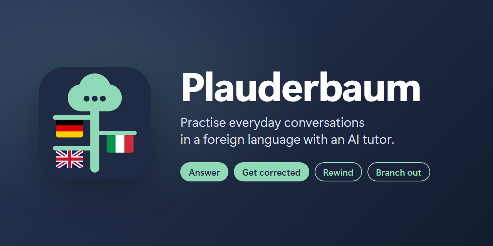
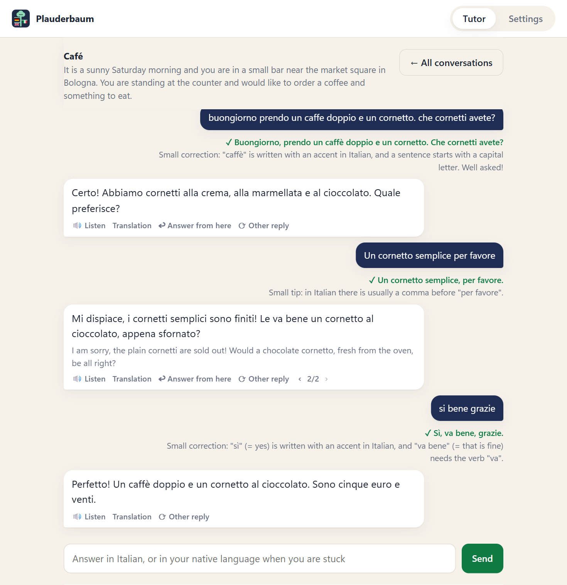
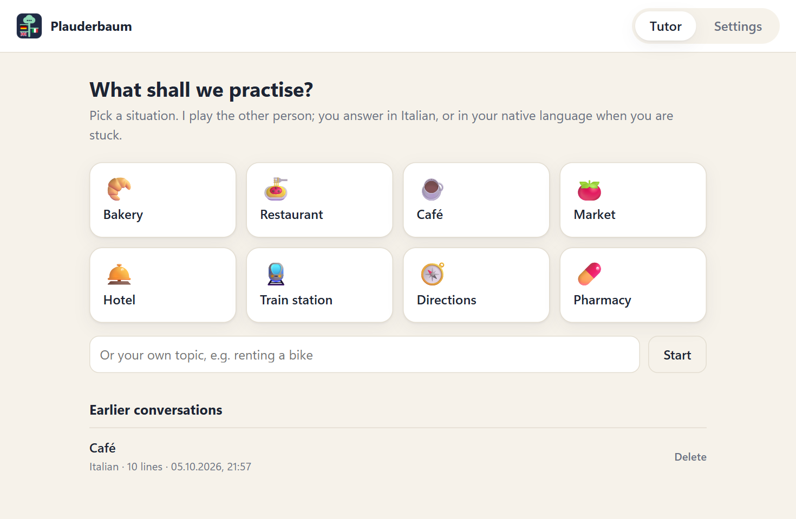
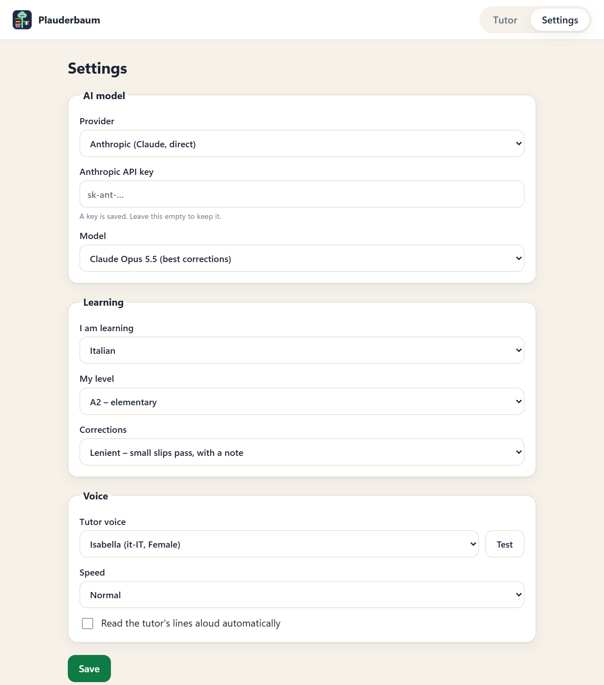

# Plauderbaum

[](https://github.com/guHe330/plauderbaum/actions/workflows/ci.yml)
[](https://github.com/guHe330/plauderbaum/releases/latest)
[](LICENSE)
[](#what-you-need)
[](#what-you-need)



A small local app for practising everyday conversations in a foreign language. You pick a situation (bakery, hotel, train station, or a topic of your own), an AI model plays the other person, and you type your side. The tutor's lines are read aloud.

- **Corrections instead of a chat.** Every message is judged before the conversation moves on. If it has errors, you see how to say it and try again.
- **Stuck? Answer in your native language.** You get the sentence in the language you are learning, in at least three variants, and then say it yourself.
- **Conversation trees.** Rewind to any point and answer differently, or ask how else the other person could have reacted. Earlier branches are kept, and you can switch between them.
- **Saved automatically.** Conversations survive a restart and can be reopened from the start page.
- **Your own key.** It talks to Claude through the Anthropic API, or to any model on OpenRouter.



> **Built entirely by an AI agent.** Every line of code, the tests and this README were written by Claude (Anthropic's coding agent, Claude Code), directed by one person in conversation. No code was written by hand. It was reviewed by using it, not by a line-by-line audit.

> **A personal tool, shared as it is.** It was made for one learner's needs (learning Italian) and is published in case it is useful to someone else. There is no roadmap and no promise of support.

> **Early and moving.** Expect a lot to change: features, file layout, the format of saved conversations. Updates may break things without a migration path.

> **Your key, your cost, your responsibility.** The app uses your own API key. Everything it spends is billed to your account, and keeping that key safe is up to you. The app sets no spending limit. See [Cost](#cost) and [Your API key](#your-api-key).

> **It is not offline.** Your conversations are sent to the AI provider you choose, and the lines that are read aloud go to Microsoft's voice service. See [What leaves your computer](#what-leaves-your-computer).

## What you need

| | |
|---|---|
| Operating system | Windows 10 or 11. The app itself is not Windows-specific, but the starter (`run.bat`) is. See [Other platforms](#other-platforms). |
| Python | 3.12 or newer |
| Browser | Microsoft Edge or Google Chrome (Edge is part of Windows) |
| API key | An [Anthropic API key](https://console.anthropic.com/) or an [OpenRouter key](https://openrouter.ai/keys), with some credit on it |
| Internet | Needed for the model and for the voice |

The API is billed by usage and is separate from a Claude.ai subscription. See [Cost](#cost).

## First start

### 1. Install Python

Skip this if `py --version` in a terminal already prints 3.12 or newer.

- Download the Windows installer from [python.org/downloads](https://www.python.org/downloads/) and run it with the default options, **or**
- run `winget install Python.Python.3.12` in a terminal.

Both install the `py` launcher that `run.bat` uses.

### 2. Get the app

Download `Plauderbaum_<version>.zip` from the [latest release](https://github.com/guHe330/plauderbaum/releases/latest) and unpack it. It contains only what is needed to run the app, in one folder named after the version.

Put the folder wherever you like. Nothing personal is stored in it.

To work on the code, or to get the newest state between releases, clone the repository instead:

```
git clone https://github.com/guHe330/plauderbaum.git
```

### 3. Run it

Double-click **`run.bat`**.

The first start takes a minute: it creates a private Python environment in the folder `.venv` and installs the pinned dependencies from `requirements.txt` into it. After an update that changes `requirements.txt`, the next start installs again. Nothing is installed system-wide. After that the app opens in its own window.

If the setup fails, delete the `.venv` folder and start `run.bat` again.

### 4. Add your API key

The app opens with a notice that a key is missing. Go to **Settings**, paste your key, choose the language you are learning and your level, and press **Save**. Then switch back to **Tutor** and pick a situation.

### Optional: a shortcut with an icon

```
powershell -ExecutionPolicy Bypass -File tools\make_shortcut.ps1
```

This creates `Plauderbaum.lnk` in the app folder. Move it to the desktop or pin it to the taskbar.

### Stopping

Close the app window. The local server stops with it.

### Updating

Download the newer zip, unpack it into a folder of its own and start it there. Settings and conversations are kept outside the app folder (see [Where your data is](#where-your-data-is)), so they carry over and the old folder can be deleted. The version you are running is shown at the bottom of the Settings tab.

## Using it



1. **Pick a situation** on the start page, or type a topic of your own.
2. **Read or listen** to the other person's line. *Translation* shows what it means, *Listen* plays it again.
3. **Type your answer.**
   - If it is fine, the conversation continues. Small slips are fixed in a note below your message.
   - If it has errors, or you answered in another language, a card shows how to say it, with alternatives. Type it again in the language you are learning.
   - You can also ask the tutor a question about the language at any time.
4. **Branch out.**
   - *↩ Answer from here* on any earlier line rewinds to that point, so you can answer differently.
   - *⟳ Other reply* asks for a different reaction from the other person.
   - Where a turn has several versions, `‹ 2/3 ›` switches between them.
5. **At the end** you get the whole conversation in its corrected form and can play it back in one go.

*← All conversations* and the logo both lead back to the start page. The conversation you leave is already saved and listed there under *Earlier conversations*.

## Settings



| Setting | Values | What it does |
|---|---|---|
| Provider | Anthropic, OpenRouter | Where the model call goes. |
| Anthropic API key | | Used when the provider is Anthropic. Leave the field empty to keep the saved key. |
| Model (Anthropic) | Claude Opus 5.5, Claude Sonnet 5.5 | Opus gives the best corrections. Sonnet is faster and cheaper. |
| OpenRouter API key | | Used when the provider is OpenRouter. |
| Model (OpenRouter) | any model id | Suggestions come from OpenRouter's list of models that support structured output. Weaker models give weaker corrections, and some cannot produce the answer format at all. |
| I am learning | Italian, Spanish, French, Portuguese, English, German | The language of the role-play. Changing it also reloads the list of voices. |
| My level | A1, A2, B1, B2 | How simple the other person's lines and the suggested sentences are. |
| Corrections | Lenient, Strict | Lenient lets small slips pass with a note. Strict makes you repeat the sentence until it is correct. |
| Tutor voice | voices for the chosen language | *Test* plays a sample. |
| Speed | Normal, Slower, Slow | Speaking rate of the voice. |
| Read aloud automatically | on, off | Whether new lines are spoken without pressing *Listen*. |

Instead of saving a key in Settings you can set the environment variable `ANTHROPIC_API_KEY` or `OPENROUTER_API_KEY`. A saved key takes precedence.

## Where your data is

Nothing personal is kept in the program folder.

| What | Where |
|---|---|
| Settings | `%APPDATA%\Plauderbaum\settings.json` |
| API keys | Windows Credential Manager, as *Plauderbaum* under *Windows Credentials* |
| Saved conversations, one file each | `%APPDATA%\Plauderbaum\conversations\` |
| Browser profile of the app window | `%LOCALAPPDATA%\Plauderbaum\browser-profile\` |

The keys are not written to a file: they are kept in the credential store of your user account and can be viewed or removed there (Control Panel → Credential Manager). A key from an earlier version that still sits in `settings.json` is moved over at the next start. Instead of saving a key you can set the environment variable `ANTHROPIC_API_KEY` or `OPENROUTER_API_KEY`.

To remove everything the app has stored, delete those two `Plauderbaum` folders and the *Plauderbaum* entries in the Credential Manager.

### What leaves your computer

- **To Anthropic or OpenRouter:** the scenario, the conversation so far and your new message, with every turn. With OpenRouter, the request is passed on to the provider of the model you chose.
- **To Microsoft:** every line that is read aloud. The voices come from Microsoft's online text-to-speech service through the [`edge-tts`](https://github.com/rany2/edge-tts) library, which uses an unofficial interface and may stop working.
- **To OpenRouter:** a request for the public model list when you open the OpenRouter settings.

There is no telemetry and no account. The app's own server listens on `127.0.0.1` only and has no login, so anything running on the same computer can reach it while the app is open.

## Cost

**You pay for what the app uses.** Every model call is made with your API key and billed to your Anthropic or OpenRouter account at their prices. The author of this app has no part in that billing and takes no responsibility for what it costs you.

Each turn is one model call that carries the whole conversation so far. *Other reply* and starting a conversation are one call each. The voices are free. As a rough, unmeasured estimate, a long session with Claude Opus stays well under one US dollar, and Sonnet costs about half of that. Other models on OpenRouter can cost much more or much less.

The app does not count what it spends and has no limit of its own. To stay in control:

- Set a spending limit or use prepaid credit in your provider's console, and check your usage there.
- Create a key just for this app, so you can see what it uses and revoke it without affecting anything else.

## Your API key

**Keeping the key safe is your responsibility.** Whoever has it can spend your credit.

- The app stores the key in your user account's credential store and sends it only to the provider it belongs to. The page never gets to see a stored key.
- That does not protect it from other programs running under your user account. They can ask the credential store for the key, or use it through the app's local server while the app is open, which has no login.
- Do not use the app on a computer or user account you share with people you would not give the key to.
- If you think a key has leaked, revoke it in your provider's console and create a new one.

More detail is in [SECURITY.md](SECURITY.md).

## How it works

```
 app window (Edge/Chrome, --app mode)
 └─ web/  plain HTML, CSS, JavaScript modules, no build step
      │  HTTP, 127.0.0.1:8765
 tutor/ Python package: FastAPI app served by uvicorn
      ├─ roleplay ──► llm ──► Anthropic API  or  OpenRouter
      ├─ speech   ──► Microsoft neural voices (edge-tts)
      ├─ settings ──► %APPDATA%\Plauderbaum\settings.json
      └─ conversations ► %APPDATA%\Plauderbaum\conversations\*.json
```

It is not Electron. `run.bat` starts a Python web server on your own machine and opens its page in an Edge or Chrome window without browser controls. The window uses a profile of its own, so it is a separate process, and the server stops when that process ends.

### One turn

1. The page sends the scenario, the path of the conversation that is currently shown, and your new message to `POST /api/turn`.
2. `roleplay` builds the prompt. `llm` sends it to the chosen provider and requires a JSON object with a fixed shape: a verdict (`ok`, `has_errors`, `other_language`, `question`, `unclear`), the ideal sentence, alternatives, an explanation, and the other person's next line.
3. The answer is checked against that shape. Anything else is reported as an unreadable answer and never reaches the page.
4. **The app decides what happens next, not the model.** On `ok`, the page adds your line and the reply to the tree. On anything else it shows the correction and stays where it was.

The model only ever sees your lines in their corrected form, so earlier mistakes do not pile up in the conversation.

### The conversation tree

A conversation is a tree of lines in which tutor and learner alternate. Rewinding and answering again, or asking for another reply, adds a sibling to an existing line instead of replacing it. The conversation on screen is one path through the tree, from the opening line to the line it currently ends on. Each line remembers which of its answers was shown last, so switching back to a branch continues where you left it.

The server keeps no conversation state between requests. The page owns the tree, sends the relevant path with every model call, and stores the whole tree through `PUT /api/conversations/{id}` after every change. Failed attempts and correction cards are not part of the tree.

### Code layout

```
run.bat               starter: creates .venv on first run, then `python -m tutor`
requirements.in       the packages used directly
requirements.txt      generated from it: every package pinned, with hashes
tutor/
  __main__.py         starts the server and the app window, stops with the window
  server.py           HTTP routes; builds the app from a data folder
  roleplay.py         scenarios, prompts, answer formats; the three model tasks
  llm/                one prompt in, one checked JSON object out
    claude.py           Anthropic API
    openrouter.py       OpenRouter API and its model list
    answer.py           parses and checks the model's answer
  models.py           the data exchanged with the page and saved to disk
  settings.py         the settings, their allowed values, their file
  keychain.py         the API keys in the system's credential store
  conversations.py    saved conversations, one JSON file each
  speech.py           text-to-speech with a small cache
  window.py           finds Edge or Chrome and opens the app window
  paths.py            program folder and per-user data folders
  errors.py           the error type whose message is shown to the learner
web/
  index.html, style.css
  main.js             entry point
  tree.js             the conversation tree; knows nothing of page or server
  session.js          what happens in an open conversation
  chat-view.js        draws a conversation; reports clicks to session.js
  home.js             start page: scenarios, own topic, earlier conversations
  settings.js         the Settings tab
  store.js            loading and saving conversations on the server
  speech.js           playback queue for spoken lines
  navigation.js       tabs and pages
  api.js, dom.js, state.js   small shared helpers
tests/                unit tests for both sides
docs/                 the banner and the screenshots in this README
tools/                the shortcut script
packaging/            builds the download package for a release
```

Dependencies are deliberately few: `fastapi` with `uvicorn` to serve it, `anthropic` for the Claude API, `edge-tts` for the voices, and `keyring` for the credential store. OpenRouter is called with Python's standard library. The page uses no framework and no packages.

## Development

Run the tests from the app folder:

```
.venv\Scripts\python.exe -m unittest discover -s tests
node --test
```

The Python tests cover settings, conversation storage, answer parsing, provider error handling and the prompts, without calling a model. The JavaScript tests cover the conversation tree and need Node.js 22 or newer; the app itself does not need Node.

To start without `run.bat`: `.venv\Scripts\python.exe -m tutor`.

### Releases

Versions are numbered `major.minor.patch`. While the major number is 0, any release may change the format of saved conversations or the settings.

The version is written down in one place, `__version__` in `tutor/__init__.py`. To publish a release:

1. Change `__version__` and commit.
2. Tag that commit `v<version>`, for example `v0.1.0`, and push the tag.

The [release workflow](.github/workflows/release.yml) refuses a tag that does not match `__version__`, runs the tests, builds `Plauderbaum_<version>.zip` with `packaging/make_zip.py`, attests where it was built and attaches it to a new GitHub release. To build the same zip locally: `python packaging/make_zip.py`, which writes to `dist/`.

## Other platforms

| | |
|---|---|
| Windows with Edge or Chrome | Works. This is what it is built and used on. |
| macOS, Linux | Not supported yet. The Python code and the page are not tied to Windows, but there is no starter script, and the app window is only looked for in the Windows install locations. |
| Firefox | Untested. Firefox has no app-window mode, so the page would run as a normal tab at `http://127.0.0.1:8765` and the server would keep running until the console window is closed. |

## Known limits

- You type; there is no speech input and no feedback on pronunciation.
- The interface, the explanations and the translations are in English only.
- Continuing a saved conversation uses the language currently set in Settings, not the one it was started in.
- Saved conversations have no version number yet, so a later change of the format may make old ones unreadable.

## Security

See [SECURITY.md](SECURITY.md) for how to report a problem.

## License

Plauderbaum is free software under the GNU General Public License, version 3 or (at your option) any later version. See [LICENSE](LICENSE). It comes without any warranty.

Happy learning!
